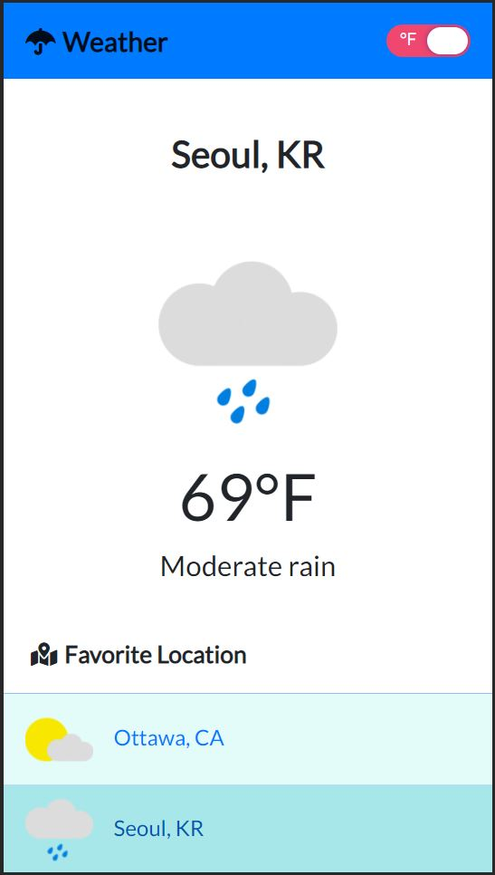

# Weather App 
[](https://travis-ci.org/joemccann/dillinger)

Responsive **Weather App** with **React** and **Bootstrap**

- OpenWeatherMap API: https://openweathermap.org/api
- ✨**React**, **Bootstrap4**, SCSS, Hooks with **Context API**

## Installation

Install the dependencies and devDependencies and start the server.

```sh
npm i
npm start
```

## Description

- The First section (left nav bars of web, bottom navbars of mobile size): one for "**Favorite Locations**" and one for displaying the weather based on a chosen location.
- The other section (right section of the web, the top section of mobile size) shows the selected location and includes (1) an icon for the current weather conditions, (2) current temperature, and (3) a description of details.
- There are Four icons related to weather conditions, such as rain, snow, sun(clear sky), and default one (Excepting three conditions the default icon will show).

### Weather icons


- Toggle the temperature to Fahrenheit or vice versa by clicking the toggle button located at the top right of the header.
### Web version


### Mobile version


